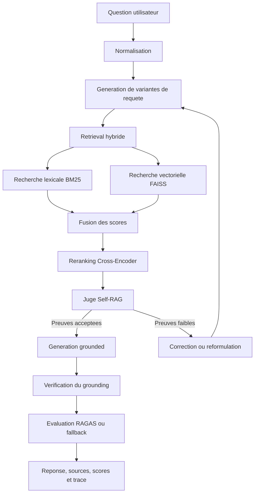

# RAG Agentique et Auto-Correctif sur Wikipedia

[English version](README.md)

Ce depot contient une demonstration de type production d'un pipeline **RAG agentique et auto-correctif** base sur un corpus Wikipedia oriente intelligence artificielle et machine learning.

L'objectif n'est pas de construire un simple chatbot. Le projet montre un workflow RAG complet : recuperation de documents, reranking, jugement de pertinence des sources, reformulation automatique quand les preuves sont faibles, generation de reponses ancrees dans les sources acceptees, verification du grounding et evaluation avec RAGAS ou un fallback local.

## Perimetre Actuel et Evaluation

Ce projet implemente **Sujet 1 : RAG Agentique et Auto-Correctif**. Il ne couvre pas le sujet separe de fine-tuning local avec QLoRA, SFT, DPO, GGUF ou vLLM.

Le pipeline RAG est complet et executable localement. La couche d'evaluation tente d'abord d'utiliser les vraies metriques RAGAS, puis bascule vers des metriques deterministes legeres quand l'environnement ne permet pas d'executer RAGAS completement.

Dans la configuration locale actuelle, aucune cle OpenAI n'est configuree. Comme RAGAS peut avoir besoin d'un LLM evaluateur, le projet peut retourner :

```text
mode: lightweight_fallback
```

C'est normal pour une demo locale sans identifiants externes. Pour executer RAGAS completement, il faut configurer un evaluateur LLM, par exemple avec une cle OpenAI ou avec les wrappers locaux Hugging Face expliques plus bas.

## Quickstart depuis GitHub

Prerequis :

- Python 3.11 recommande
- Git
- Acces Internet au premier lancement, car les articles Wikipedia et certains modeles Hugging Face peuvent devoir etre telecharges

Cloner le depot :

```bash
git clone https://github.com/Mekki-DAMAK/agentic-self-corrective-rag-wikipedia.git
cd agentic-self-corrective-rag-wikipedia
```

Creer et activer un environnement virtuel :

```bash
python -m venv .venv
source .venv/bin/activate
```

Sous Windows PowerShell :

```powershell
py -3.11 -m venv .venv
.\.venv\Scripts\Activate.ps1
```

Installer le projet avec les dependances de developpement, evaluation et tracking :

```bash
python -m pip install --upgrade pip
python -m pip install -e ".[dev,eval,tracking]"
```

Construire le dataset Wikipedia et les index de retrieval :

```bash
python scripts/download_wikipedia_subset.py --config configs/default.yaml
python scripts/build_index.py --config configs/default.yaml
```

Lancer l'application Streamlit :

```bash
streamlit run app/streamlit_app.py
```

Ouvrir l'URL locale affichee par Streamlit, generalement :

```text
http://localhost:8501
```

Tester une question depuis le terminal :

```bash
python scripts/ask_terminal.py "What is overfitting?"
```

Lancer les verifications qualite :

```bash
ruff check .
mypy src scripts app
pytest -q
```

Lancer l'evaluation batch :

```bash
python scripts/evaluate_ragas.py --config configs/default.yaml
```

Sans cle OpenAI ni evaluateur RAGAS local, l'evaluation fonctionne quand meme en `mode: lightweight_fallback`.

## Exigences Implementees

| Exigence | Implementation |
|---|---|
| Boucle Agentic Self-RAG | Pipeline multi-tentatives avec rejet des sources et reformulation automatique |
| Hybrid search | Retrieval lexical BM25 combine avec recherche vectorielle FAISS |
| Multi-query retrieval | Generation de variantes de requete a chaque tentative |
| Reranking | Cross-Encoder pour reclasser les passages candidats |
| Source judge | Juge Self-RAG qui accepte ou rejette les chunks selon leur pertinence |
| Correction de requete | Correction de fautes basee sur le vocabulaire du dataset |
| Generation grounded | Reponses generees uniquement a partir des sources acceptees |
| Verification | Verification que la reponse est supportee par les sources |
| Evaluation | RAGAS faithfulness / answer relevancy avec fallback deterministe |
| Qualite repo | Poetry, Ruff, MyPy, Pytest, Docker, GitHub Actions, W&B optionnel |

## A Quoi Sert ce Modele

Ce projet est utile quand un utilisateur veut des reponses fondees sur une base de connaissance technique limitee, plutot que des reponses libres de chatbot. Le corpus actuel est centre sur l'intelligence artificielle et le machine learning, donc le systeme est adapte a des questions comme :

- What is machine learning?
- What is overfitting?
- What is the difference between supervised and unsupervised learning?
- How does BM25 differ from vector search?
- What is a transformer architecture?
- What is retrieval-augmented generation?

La valeur principale du projet n'est pas seulement le retrieval. Le pipeline se comporte comme un petit agent de recherche :

- il cherche avec retrieval lexical et semantique ;
- il genere plusieurs variantes de requete ;
- il rerank les passages avec un Cross-Encoder ;
- il juge si les chunks recuperes sont reellement utiles ;
- il peut rejeter des preuves faibles au lieu de forcer une reponse ;
- il peut corriger des requetes avec fautes comme `machie leaning` ;
- il peut reformuler la recherche si les preuves sont faibles ;
- il verifie que les reponses sont ancrees dans les sources acceptees ;
- il expose les sources, scores, tentatives et metriques d'evaluation.

Cela en fait une demo solide pour recruteur : le projet montre la qualite du retrieval, le grounding, l'observabilite, l'evaluation et la gestion des echecs.

## Dataset : Perimetre et Collecte

Le dataset est un corpus Wikipedia focalise sur l'IA et le machine learning. Le but est de garder une base assez petite pour tourner localement, mais assez riche pour tester un comportement RAG realiste.

La liste des documents Wikipedia est choisie manuellement dans `configs/default.yaml` :

```yaml
wikipedia:
  language: "en"
  articles:
    - Artificial intelligence
    - Machine learning
    - Deep learning
    - Supervised learning
    - Unsupervised learning
    - Reinforcement learning
    - Artificial neural network
    - Natural language processing
    - Transformer (deep learning architecture)
    - Large language model
```

La liste complete couvre :

- concepts de base de l'IA et du machine learning ;
- deep learning et reseaux de neurones ;
- transformers et grands modeles de langage ;
- apprentissage supervise, non supervise et par renforcement ;
- algorithmes classiques comme random forest, SVM, k-nearest neighbors et k-means ;
- evaluation comme overfitting et cross-validation ;
- domaines lies comme NLP, computer vision, speech recognition, data mining et information retrieval.

Le telechargement est effectue par `scripts/download_wikipedia_subset.py`. Pour chaque titre configure, le script appelle l'API Wikipedia :

```text
https://en.wikipedia.org/w/api.php
```

avec des parametres equivalents a :

```text
action=query
prop=extracts
explaintext=1
format=json
titles=<article title>
redirects=1
```

La requete inclut un `User-Agent` pour indiquer a Wikipedia qu'il s'agit d'une demo educative. Cela evite les erreurs classiques `403 Forbidden` liees aux requetes automatiques anonymes.

Les articles telecharges sont sauvegardes dans :

```text
data/raw/wikipedia_subset.jsonl
```

Si le telechargement Wikipedia echoue, le projet utilise un corpus AI/ML embarque dans `src/self_rag_pro/ingest/sample_corpus.py`. Ce fallback permet a la demo de rester executable meme hors ligne ou dans un environnement restreint. Quand Wikipedia fonctionne, les documents telecharges sont fusionnes avec ce corpus embarque, puis dedupliques par identifiant.

Avec la configuration actuelle, un build reussi produit environ :

```text
57 documents bruts
1016 chunks traites
```

Le nombre exact peut varier si Wikipedia change ou si les parametres de chunking sont modifies.

## Nettoyage et Preprocessing du Dataset

Le texte brut Wikipedia est nettoye avant l'indexation. La logique se trouve dans `src/self_rag_pro/core/chunking.py`.

Le preprocessing :

- supprime les sections bruites comme `References`, `See also`, `External links`, `Further reading`, `Bibliography` et `Notes` ;
- supprime les marqueurs de citation comme `[1]`, `[2]` ;
- reduit les sauts de lignes excessifs ;
- ignore les articles trop courts ;
- separe le texte par paragraphes ;
- cree des chunks chevauchants pour ne pas perdre l'information aux frontieres ;
- supprime les chunks trop courts.

Configuration par defaut :

```yaml
chunking:
  chunk_size: 900
  chunk_overlap: 160
  min_chunk_chars: 250
```

Les chunks traites sont sauvegardes dans :

```text
data/processed/chunks.jsonl
```

Puis `scripts/build_index.py` construit :

```text
data/processed/embeddings.npy
data/processed/faiss.index
data/processed/bm25.pkl
```

Ces fichiers generes sont exclus de Git, car ils peuvent etre reconstruits localement.

## Retrieval et Raisonnement Agentique

Le modele utilise une strategie de retrieval hybride :

- BM25 recupere les passages avec correspondance exacte de mots et acronymes ;
- FAISS recupere les passages semantiquement proches avec des embeddings ;
- les scores sont fusionnes ;
- des bonus de titre et de definition favorisent les passages directement explicatifs ;
- un Cross-Encoder rerank les meilleurs candidats en lisant la requete et le passage ensemble.

Apres retrieval, le juge Self-RAG verifie si les preuves sont assez fortes. Il utilise le recouvrement lexical, les correspondances de titre, le nombre de sources utiles et la confiance du retrieval. Si les sources sont faibles, l'agent peut les rejeter et reformuler la requete.

C'est important, car un RAG classique recupere souvent quelque chose meme pour une question hors domaine. Ce projet essaie explicitement d'eviter cela. Par exemple :

```text
Who won the 2022 FIFA World Cup?
```

doit etre rejete, car le corpus concerne l'IA et le machine learning, pas le sport.

## Fonctionnalites Avancees

| Fonctionnalite | Objectif |
|---|---|
| Multi-query retrieval | Etendre une question en plusieurs variantes de recherche |
| Hybrid BM25 + FAISS retrieval | Combiner recherche exacte et similarite semantique |
| Fusion des scores | Fusionner preuves lexicales, vectorielles, titre et definition |
| Cross-Encoder reranking | Ameliorer la precision apres retrieval large |
| Self-RAG judge | Accepter ou rejeter les preuves avant generation |
| Correction de requete | Corriger les fautes avec le vocabulaire du dataset |
| Reformulation de requete | Tenter une meilleure recherche si les preuves sont faibles |
| Grounded generation | Repondre uniquement depuis les sources acceptees |
| Verification de reponse | Verifier que les termes de la reponse sont supportes par les sources |
| Integration RAGAS | Evaluer faithfulness et answer relevancy quand un evaluateur est disponible |
| Evaluation fallback | Garder une evaluation locale sans identifiants externes |
| Interface Streamlit | UI interactive avec sources, scores, traces et evaluation |
| Wrapper W&B | Tracking optionnel des tentatives, confiances et metriques |

## Architecture



## Structure du Depot

```text
app/
  streamlit_app.py              Interface Streamlit
configs/
  default.yaml                  Configuration principale
data/raw/
  wikipedia_subset.jsonl        Corpus brut Wikipedia
scripts/
  download_wikipedia_subset.py  Telechargement Wikipedia ou fallback
  build_index.py                Construction chunks, embeddings, FAISS et BM25
  ask_terminal.py               Poser une question dans le terminal
  evaluate_ragas.py             Evaluation batch
src/self_rag_pro/
  agent/                        Multi-query, correction, rewriting, juge Self-RAG
  core/                         Chunking, embeddings, retrieval, reranking, answering
  evaluation/                   RAGAS et metriques fallback
  ingest/                       Stockage et corpus embarque
  utils/                        Config, device, tracking W&B
tests/                          Tests unitaires
.github/workflows/ci.yml        CI lint, typing, tests et Docker
Dockerfile                      Application conteneurisee
```

## Lancement Local avec pip

```bash
python -m venv .venv
source .venv/bin/activate
python -m pip install --upgrade pip
python -m pip install -e ".[dev,eval,tracking]"
```

Sous Windows PowerShell :

```powershell
py -3.11 -m venv .venv
.\.venv\Scripts\Activate.ps1
python -m pip install --upgrade pip
python -m pip install -e ".[dev,eval,tracking]"
```

## Lancement Local avec Poetry

```bash
pip install poetry
poetry install --extras "dev eval tracking"
```

## Construire le Dataset et les Index

```bash
python scripts/download_wikipedia_subset.py --config configs/default.yaml
python scripts/build_index.py --config configs/default.yaml
```

Cela cree :

```text
data/processed/chunks.jsonl
data/processed/embeddings.npy
data/processed/faiss.index
data/processed/bm25.pkl
```

## Lancer l'Application Streamlit

```bash
streamlit run app/streamlit_app.py
```

Puis ouvrir :

```text
http://localhost:8501
```

## Docker

```bash
docker build -t self-rag-wikipedia-demo .
docker run --rm -p 8501:8501 -v "${PWD}/data:/app/data" self-rag-wikipedia-demo
```

Windows PowerShell :

```powershell
docker build -t self-rag-wikipedia-demo .
docker run --rm -p 8501:8501 -v ${PWD}/data:/app/data self-rag-wikipedia-demo
```

Ou avec Docker Compose :

```bash
docker compose up --build
```

## Tester depuis le Terminal

```bash
python scripts/ask_terminal.py "What is overfitting?"
python scripts/ask_terminal.py "What is machie leaning?"
python scripts/ask_terminal.py "what is artficel inteleggence?"
```

## Evaluation RAGAS

Le projet integre deux metriques RAGAS :

- `faithfulness`
- `answer_relevancy`

Par defaut, le code essaie RAGAS. Si l'environnement ne permet pas de l'executer, il utilise un fallback deterministe.

Configuration :

```yaml
evaluation:
  use_ragas: true
  use_local_ragas_wrappers: false
  fallback_lightweight_metrics: true
```

### Mode RAGAS Reel

Pour utiliser RAGAS avec OpenAI :

Linux/macOS :

```bash
export OPENAI_API_KEY="your_api_key_here"
python scripts/evaluate_ragas.py --config configs/default.yaml
```

Windows PowerShell :

```powershell
$env:OPENAI_API_KEY="your_api_key_here"
python scripts/evaluate_ragas.py --config configs/default.yaml
```

Quand RAGAS fonctionne completement :

```text
mode: ragas
```

### Mode Fallback Actuel

Sans cle OpenAI ou evaluateur local, le code utilise `lightweight_scores()` dans `src/self_rag_pro/evaluation/ragas_eval.py`.

Le fallback `faithfulness` est calcule comme :

```text
nombre de termes importants de la reponse presents dans les sources
/
nombre de termes importants de la reponse
```

Le fallback `answer_relevancy` est calcule comme :

```text
nombre de termes importants de la question presents dans la reponse
/
nombre de termes importants de la question
```

Le score global est :

```text
score_global = (faithfulness + answer_relevancy) / 2
```

Limite importante : ce fallback est lexical. Il est utile pour les tests locaux, mais il peut etre trop optimiste. Pour une evaluation finale, il faut utiliser un vrai evaluateur RAGAS avec une cle OpenAI ou un modele local configure.

## W&B Optionnel

W&B est desactive par defaut. Pour l'activer dans `configs/default.yaml` :

```yaml
tracking:
  enabled: true
  project: "self-rag-wikipedia-demo"
  mode: "offline"
```

Les logs incluent les tentatives, le nombre de sources acceptees, le grounding ratio, la confiance, faithfulness, answer relevancy et le score global.

## CI/CD

GitHub Actions execute :

```text
ruff check .
mypy src scripts app
pytest -q
docker build
```

## Compromis Techniques

BM25 est conserve car il gere bien les termes techniques exacts, acronymes et noms de modeles. FAISS ameliore le rappel semantique quand la question est formulee differemment du texte source. Le Cross-Encoder ameliore la precision mais ajoute de la latence. La boucle Self-RAG ameliore le grounding en rejetant les preuves faibles et en reformulant la requete, au prix de plusieurs tentatives possibles. RAGAS fournit un cadre standard d'evaluation, tandis que les metriques fallback gardent la demo utilisable dans un environnement local ou restreint.
