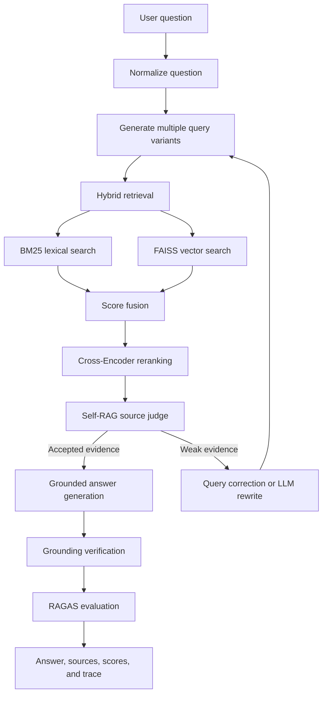

# Agentic and Self-Corrective RAG on Wikipedia

[Version francaise](README.fr.md)

This repository contains a production-style demonstration of an **agentic and self-corrective Retrieval-Augmented Generation pipeline** on a Wikipedia-based AI and machine learning corpus.

The goal is not to provide a basic chatbot. The application demonstrates a complete RAG workflow where an agent retrieves candidate documents, reranks them, judges source usefulness, reformulates the query when evidence is weak, generates a grounded answer from accepted sources only, verifies the answer against the retrieved evidence, and evaluates the result with RAGAS metrics.

## Current Scope and Evaluation Status

This repository implements **Subject 1: Agentic and Self-Corrective RAG**. It does not implement the separate fine-tuning topic based on QLoRA, SFT, DPO, GGUF, or vLLM.

The RAG pipeline is complete and runnable locally. The evaluation layer is designed to use real RAGAS metrics first, then fall back to deterministic lightweight metrics when the environment cannot run RAGAS.

In the current default local setup, no OpenAI API key is configured. Because RAGAS can require an evaluator LLM, the project may report:

```text
mode: lightweight_fallback
```

This is expected for a local demo without external credentials. To run full RAGAS evaluation, configure an evaluator LLM, for example by setting an OpenAI API key or by enabling the local Hugging Face evaluator wrappers described below.

## Quickstart from GitHub

Prerequisites:

- Python 3.11 recommended
- Git
- Internet access for the first run, because Wikipedia articles and Hugging Face models may need to be downloaded

Clone the repository:

```bash
git clone https://github.com/Mekki-DAMAK/agentic-self-corrective-rag-wikipedia.git
cd agentic-self-corrective-rag-wikipedia
```

Create and activate a virtual environment:

```bash
python -m venv .venv
source .venv/bin/activate
```

On Windows PowerShell:

```powershell
py -3.11 -m venv .venv
.\.venv\Scripts\Activate.ps1
```

Install the project with development, evaluation, and tracking extras:

```bash
python -m pip install --upgrade pip
python -m pip install -e ".[dev,eval,tracking]"
```

Build the Wikipedia dataset and retrieval indexes:

```bash
python scripts/download_wikipedia_subset.py --config configs/default.yaml
python scripts/build_index.py --config configs/default.yaml
```

Run the Streamlit application:

```bash
streamlit run app/streamlit_app.py
```

Open the local URL displayed by Streamlit, usually:

```text
http://localhost:8501
```

Ask one question from the terminal:

```bash
python scripts/ask_terminal.py "What is overfitting?"
```

Run quality checks:

```bash
ruff check .
mypy src scripts app
pytest -q
```

Run batch evaluation:

```bash
python scripts/evaluate_ragas.py --config configs/default.yaml
```

Without an OpenAI API key or local RAGAS evaluator, evaluation will still run with `mode: lightweight_fallback`. See the RAGAS section below for full evaluation setup.

## Implemented Requirements

| Requirement | Implementation |
|---|---|
| Agentic Self-RAG loop | Multi-attempt retrieval pipeline with source rejection and automatic reformulation |
| Hybrid search | BM25 lexical retrieval combined with FAISS dense vector retrieval |
| Multi-query retrieval | Query variants are generated for each retrieval attempt |
| Reranking | Cross-Encoder reranker normalizes and combines ranking evidence |
| Source judge | Self-RAG judge accepts or rejects chunks according to relevance and usefulness |
| Query correction | Dataset-driven typo correction and optional local LLM query rewriting |
| Grounded generation | Final answers are generated from accepted sources only |
| Verification | The answer is checked against accepted source contexts |
| Evaluation | RAGAS faithfulness and answer relevancy with deterministic fallback metrics |
| Repository quality | Poetry/uv-compatible package, Ruff, MyPy, Pytest, Docker, GitHub Actions, optional W&B tracking |

## What This Model Is Useful For

This project is useful when a user needs grounded answers over a focused technical knowledge base instead of open-ended chatbot answers. The current corpus focuses on artificial intelligence and machine learning concepts, so the system is designed for questions such as:

- What is machine learning?
- What is overfitting?
- What is the difference between supervised and unsupervised learning?
- How does BM25 differ from vector search?
- What is a transformer architecture?
- What is retrieval-augmented generation?

The main value of the project is not just retrieval. The pipeline behaves like a small search agent:

- It searches with both lexical and semantic retrieval.
- It generates multiple query variants to improve recall.
- It reranks candidate passages with a Cross-Encoder.
- It judges whether retrieved chunks are actually useful.
- It can reject weak evidence instead of forcing an answer.
- It can correct typo-heavy queries such as `machie leaning`.
- It can reformulate the search when evidence is weak.
- It verifies that generated answers are grounded in accepted sources.
- It exposes sources, scores, attempts, and evaluation metrics for inspection.

This makes the system useful as a recruiter-ready demo of an agentic RAG workflow: it shows retrieval quality, answer grounding, observability, evaluation, and failure handling rather than only a basic question-answering UI.

## Dataset Scope and Collection

The dataset is a focused Wikipedia-based AI and machine learning corpus. The goal is to keep the knowledge base small enough to run locally, but rich enough to test realistic RAG behavior.

The list of Wikipedia documents is selected manually in `configs/default.yaml` under:

```yaml
wikipedia:
  language: "en"
  articles:
    - Artificial intelligence
    - Machine learning
    - Deep learning
    - Supervised learning
    - Unsupervised learning
    - Reinforcement learning
    - Artificial neural network
    - Natural language processing
    - Transformer (deep learning architecture)
    - Large language model
```

The full list contains AI/ML topics covering:

- Core AI and machine learning concepts
- Deep learning and neural networks
- Transformers and large language models
- Supervised, unsupervised, and reinforcement learning
- Classical ML algorithms such as random forests, SVM, k-nearest neighbors, and k-means
- Evaluation concepts such as overfitting and cross-validation
- Related areas such as NLP, computer vision, speech recognition, data mining, and information retrieval

The dataset is downloaded by `scripts/download_wikipedia_subset.py`. For each configured title, the script calls the Wikipedia API:

```text
https://en.wikipedia.org/w/api.php
```

with parameters equivalent to:

```text
action=query
prop=extracts
explaintext=1
format=json
titles=<article title>
redirects=1
```

The request includes a `User-Agent` header so Wikipedia can identify the request as an educational demo. This avoids common `403 Forbidden` failures caused by anonymous automated requests.

Downloaded articles are saved to:

```text
data/raw/wikipedia_subset.jsonl
```

If Wikipedia download fails, the project falls back to a bundled AI/ML sample corpus from `src/self_rag_pro/ingest/sample_corpus.py`. This fallback keeps the demo runnable offline or in restricted environments. When Wikipedia download succeeds, the downloaded Wikipedia documents are merged with the bundled corpus and deduplicated by document id.

With the current default configuration, a successful build produces approximately:

```text
57 raw documents
1016 processed chunks
```

The exact number of chunks can change if Wikipedia content changes or if chunking settings are modified.

## Dataset Cleaning and Preprocessing

The raw Wikipedia text is cleaned before indexing. The cleaning logic is implemented in `src/self_rag_pro/core/chunking.py`.

The preprocessing step:

- removes noisy terminal sections such as `References`, `See also`, `External links`, `Further reading`, `Bibliography`, and `Notes`
- removes citation markers such as `[1]`, `[2]`, and similar reference artifacts
- collapses excessive blank lines
- skips articles that are too short during download
- splits text by paragraphs
- creates overlapping chunks so information near chunk boundaries is not lost
- drops chunks shorter than the configured minimum character length

The default chunking configuration is:

```yaml
chunking:
  chunk_size: 900
  chunk_overlap: 160
  min_chunk_chars: 250
```

The processed chunks are saved to:

```text
data/processed/chunks.jsonl
```

Then `scripts/build_index.py` builds:

```text
data/processed/embeddings.npy
data/processed/faiss.index
data/processed/bm25.pkl
```

These generated files are intentionally excluded from Git because they can be rebuilt locally from the raw dataset and configuration.

## Retrieval and Agentic Reasoning

The model uses a hybrid retrieval strategy:

- BM25 retrieves passages with exact keyword and acronym matches.
- FAISS vector search retrieves semantically similar passages using sentence embeddings.
- Scores are fused with configurable weights.
- Title-match and definition-pattern bonuses help prioritize direct concept explanations.
- A Cross-Encoder reranker reorders the strongest candidates by reading the query and passage together.

After retrieval, the Self-RAG judge checks whether the evidence is strong enough. It looks at lexical overlap, title matches, useful source count, and retrieval confidence. If sources are weak, the agent can reject them and reformulate the query for another attempt.

This is important because a normal RAG pipeline often retrieves something even for an unrelated question. This project explicitly tries to avoid that behavior. For example, an out-of-domain question such as:

```text
Who won the 2022 FIFA World Cup?
```

should be rejected because the corpus is about AI and machine learning, not sports.

## Advanced Features

The project includes several features that go beyond a basic RAG demo:

| Feature | Purpose |
|---|---|
| Multi-query retrieval | Expands a user question into several search variants |
| Hybrid BM25 + FAISS retrieval | Combines exact term matching and semantic similarity |
| Score fusion | Merges lexical, vector, title, and definition evidence |
| Cross-Encoder reranking | Improves precision after broad retrieval |
| Self-RAG judge | Accepts or rejects evidence before answer generation |
| Query correction | Fixes domain-specific typos using the dataset vocabulary |
| Query reformulation | Tries a better query when evidence is weak |
| Grounded generation | Answers only from accepted source chunks |
| Answer verification | Checks whether answer terms are supported by sources |
| RAGAS integration | Evaluates faithfulness and answer relevancy when an evaluator is available |
| Fallback evaluation | Keeps local demos evaluable without external credentials |
| Streamlit UI | Provides an interactive app with sources, scores, traces, and evaluation |
| W&B wrapper | Optional experiment tracking for attempts, confidence, and evaluation metrics |

## Architecture



## Repository Structure

```text
app/
  streamlit_app.py              Streamlit user interface
configs/
  default.yaml                  Main configuration
data/raw/
  wikipedia_subset.jsonl        Small starter corpus for reproducible local runs
docs/
  technical_tradeoffs.md        Architecture decisions and trade-offs
scripts/
  download_wikipedia_subset.py  Download Wikipedia articles or use fallback corpus
  build_index.py                Build chunks, embeddings, FAISS, and BM25 indexes
  ask_terminal.py               Ask a single question from the terminal
  evaluate_ragas.py             Run batch evaluation
  docker_entrypoint.sh          Docker startup script that prepares indexes if needed
src/self_rag_pro/
  agent/                        Multi-query, correction, rewriting, Self-RAG judging
  core/                         Chunking, embeddings, retrieval, reranking, answering
  evaluation/                   RAGAS integration and local fallback metrics
  ingest/                       Storage and bundled corpus helpers
  models/                       Dataclasses used by the pipeline
  utils/                        Config, device, and W&B telemetry helpers
  pipeline.py                   Main orchestration
tests/                          Unit tests
.github/workflows/ci.yml        CI for linting, typing, tests, and Docker build
Dockerfile                      Containerized application
Makefile                        Developer shortcuts
```

## Local Setup with pip

Python 3.11 is recommended.

```bash
python -m venv .venv
source .venv/bin/activate
python -m pip install --upgrade pip
python -m pip install -e ".[dev,eval,tracking]"
```

On Windows PowerShell:

```powershell
py -3.11 -m venv .venv
.\.venv\Scripts\Activate.ps1
python -m pip install --upgrade pip
python -m pip install -e ".[dev,eval,tracking]"
```

## Local Setup with Poetry

```bash
pip install poetry
poetry install --extras "dev eval tracking"
```

## Quality Checks

```bash
ruff check .
mypy src scripts app
pytest -q
```

With Poetry:

```bash
poetry run ruff check .
poetry run mypy src scripts app
poetry run pytest -q
```

## Build the Dataset and Indexes

Generated indexes are intentionally not committed to Git. Build them locally before running the application outside Docker:

```bash
python scripts/download_wikipedia_subset.py --config configs/default.yaml
python scripts/build_index.py --config configs/default.yaml
```

This creates:

```text
data/processed/chunks.jsonl
data/processed/embeddings.npy
data/processed/faiss.index
data/processed/bm25.pkl
```

If Wikipedia download fails, the project falls back to the bundled AI and machine learning corpus so the demo remains runnable.

## Run the Streamlit Application Locally

```bash
streamlit run app/streamlit_app.py
```

Then open the local URL displayed by Streamlit, usually:

```text
http://localhost:8501
```

## Run with Docker

The Docker image provides a reproducible environment. At startup, it checks whether processed indexes exist and builds them automatically when needed.

```bash
docker build -t self-rag-wikipedia-demo .
docker run --rm -p 8501:8501 -v "${PWD}/data:/app/data" self-rag-wikipedia-demo
```

On Windows PowerShell:

```powershell
docker build -t self-rag-wikipedia-demo .
docker run --rm -p 8501:8501 -v ${PWD}/data:/app/data self-rag-wikipedia-demo
```

You can also use Docker Compose:

```bash
docker compose up --build
```

Then open:

```text
http://localhost:8501
```

## Run One Question from the Terminal

```bash
python scripts/ask_terminal.py "What is overfitting?"
```

Useful examples for validating the correction and reformulation loop:

```bash
python scripts/ask_terminal.py "What is machie leaning?"
python scripts/ask_terminal.py "what is artficel inteleggence?"
python scripts/ask_terminal.py "Explain the difference between supervised learning and unsupervised learning."
```

## Run Batch Evaluation

```bash
python scripts/evaluate_ragas.py --config configs/default.yaml
```

The Streamlit app also provides an evaluation tab with scores, charts, a detailed table, and Excel export.

## RAGAS Evaluation

The project integrates RAGAS with two metrics:

- `faithfulness`
- `answer_relevancy`

The default configuration attempts to run RAGAS first. If the current environment cannot run RAGAS, the application returns deterministic fallback metrics and clearly reports the evaluation mode.

Relevant configuration:

```yaml
evaluation:
  use_ragas: true
  use_local_ragas_wrappers: false
  fallback_lightweight_metrics: true
```

### Real RAGAS Mode

When `use_local_ragas_wrappers: false`, RAGAS uses its default evaluator stack. In many environments this requires an OpenAI-compatible evaluator LLM. For full RAGAS scoring with OpenAI, set an API key before running evaluation.

Linux/macOS:

```bash
export OPENAI_API_KEY="your_api_key_here"
python scripts/evaluate_ragas.py --config configs/default.yaml
```

Windows PowerShell:

```powershell
$env:OPENAI_API_KEY="your_api_key_here"
python scripts/evaluate_ragas.py --config configs/default.yaml
```

When real RAGAS succeeds, result dictionaries report:

```text
mode: ragas
```

### Local RAGAS Evaluator Option

For a fully local evaluator, set `use_local_ragas_wrappers: true` and configure:

```yaml
models:
  ragas_llm: "google/flan-t5-small"
  ragas_embeddings: "sentence-transformers/all-MiniLM-L6-v2"
```

This mode avoids an OpenAI key, but it requires the local evaluator model and embedding model to be available. The first run may download models from Hugging Face unless `runtime.offline: true` and the models are already cached.

### Current Fallback Mode

If real RAGAS fails because no evaluator key/model is available, the code falls back to `lightweight_scores()` in `src/self_rag_pro/evaluation/ragas_eval.py`.

The fallback is deterministic and lexical. It is useful for local smoke tests and UI demos, but it is not as strong as real RAGAS because it does not use an evaluator LLM to judge meaning.

Fallback `faithfulness` is computed as:

```text
number of important answer terms found in the retrieved source text
/
number of important answer terms
```

Fallback `answer_relevancy` is computed as:

```text
number of important question terms also found in the answer
/
number of important question terms
```

The batch global score is the average of the two:

```text
score_global = (faithfulness + answer_relevancy) / 2
```

Example fallback output:

```text
faithfulness: 1.0
answer_relevancy: 0.9167
mode: lightweight_fallback
```

Important limitation: the fallback can be too optimistic because it checks lexical overlap rather than semantic correctness. For final benchmarking, recruiter demos, or a production report, use real RAGAS with an evaluator LLM.

### What Is Needed for Complete Evaluation

To make the evaluation layer fully complete rather than fallback-only, configure one of these:

1. OpenAI-backed RAGAS evaluation with `OPENAI_API_KEY`.
2. Local RAGAS evaluation with `use_local_ragas_wrappers: true` and cached/downloaded Hugging Face evaluator models.

Without one of these, the RAG pipeline still runs correctly, but evaluation results should be described as fallback metrics, not full RAGAS judgments.

## Optional W&B Tracking

W&B tracking is disabled by default. Enable it in `configs/default.yaml`:

```yaml
tracking:
  enabled: true
  project: "self-rag-wikipedia-demo"
  mode: "offline"
```

Logged values include attempts, accepted source count, grounding ratio, confidence, faithfulness, answer relevancy, and global evaluation score.

## CI/CD

The GitHub Actions workflow runs:

```text
ruff check .
mypy src scripts app
pytest -q
docker build
```

This validates code style, type checking, unit tests, and Docker packaging before merging.

## Technical Trade-offs

BM25 is retained because it handles exact technical terms, acronyms, and model names well. FAISS dense retrieval improves semantic recall when the question is phrased differently from the source text. The Cross-Encoder reranker improves precision but increases latency. The Self-RAG loop improves grounding by rejecting weak evidence and reformulating queries, at the cost of additional retrieval attempts. RAGAS provides a standard evaluation framework, while fallback metrics keep the demo usable in offline or restricted environments.
